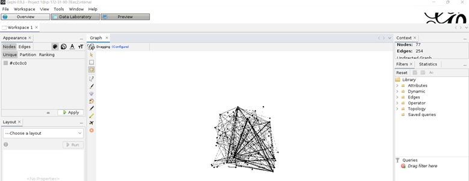

Gephi Installation for Cent OS
===============================

1. Install Java
  
  ``yum install java-1.8.0-openjdk``

2.	Download the latest linux gephi installer from https://gephi.org/users/download/ 
  
  ``wget -q https://github.com/gephi/gephi/releases/download/v0.9.3/gephi-0.9.3-linux-x64.tar.gz``

3.	Extract the Gephi 
  
  ``tar xvf gephi-0.9.3-linux-x64.tar.gz``
  
4.	Configure X11 forwarding
  
  ``vi /etc/ssh/sshd_config``
  
5.	Make below parameter as Yes
  
  * X11Forwarding yes
  
6.	Verify X11Forwarding parameter

  * cat /etc/ssh/sshd_config |grep -i X11Forwarding
  
7.	You should see similar output as the following:

  * X11Forwarding yes
  
8.	Restart ssh service

  * service sshd restart
  
9.	From any SSH client such as MobaXterm on local machine connect to remote machine with X11 forward 
  
   ``DISPLAY=127.0.0.1:0  ssh -i CentOS-OS.pem -Y centos@54.159.140.179 /opt/gephi-0.9.3/bin/gephi``
   
  

Developed By: Anusha Srirenganathan

Documented By: Kennedy Carper

Tested By: -
