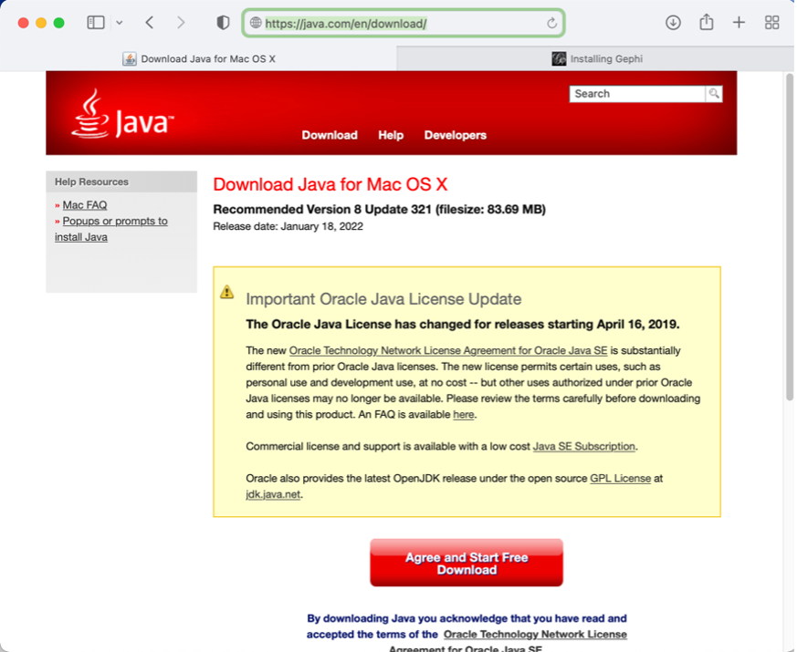
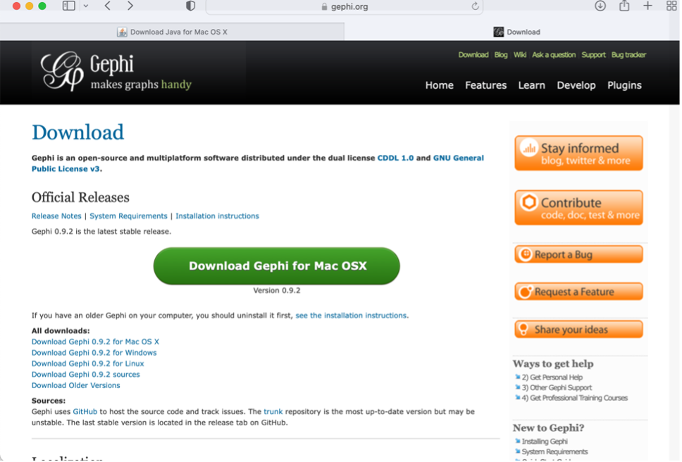
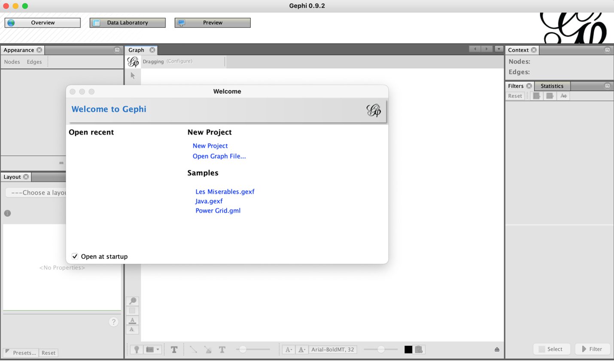

Gephi Installation on MacOS systems
===================================

1. If you don’t have Java Runtime Environment yet, please download and install Java 8 from https://java.com/en/download/ by clicking on the red button to download and install Java 8. 

2. Download Gephi onto your system from https://gephi.org/users/install/ 

  -	Click the orange download button
  
  -	Ensure the download is for the correct system
  
  -	Press allow

3. Once downloaded find the Gephi.dmg file in your system’s finder

  -	Open Gephi and enjoy its services, you’ve successfully downloaded Gephi onto your macOS system

Developed by: Kennedy Carper 
Documented by: Shyra LaGarde
Tested by: -
