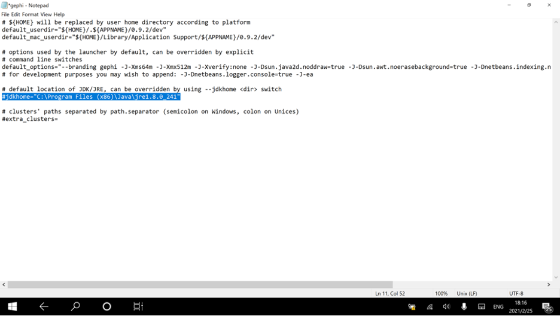
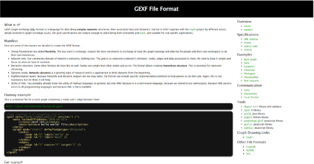
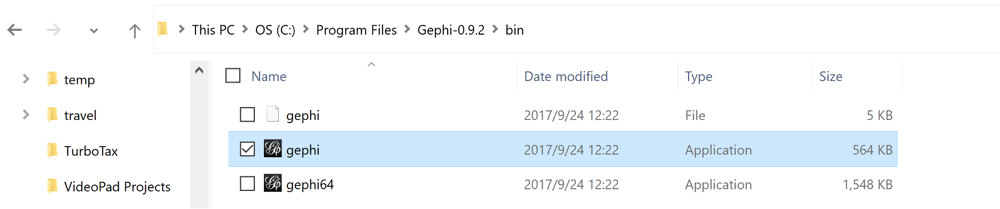
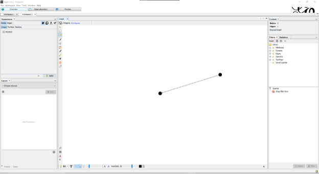

Installing Gephi on Windows OS
==============================

1. If you don’t have Java Runtime Environment yet, please download and install Java 8 from https://java.com/en/download/ by click on the red button to download and install Java 8. 

    
2. Download gephi installation version from https://gephi.org/

3. Configure file 

“C:\\Program Files\\Gephi-0.9.2\\etc\\gephi.conf” by setting 

jdkhome="C:\\Program Files (x86)\\Java\\jre1.8.0_241" (please change the text to your java path on your computer)

Note: your JDK JRE folder maybe different. 

4. Go to http://gexf.net/ and install the “Hello-world.gexf’’ GEXF File Format. It will be the green HTML link  under Dummy files that you need to click on.

    
5.	Launch Gephi and open the data file “Hello-world.gexf you may need to choose the 32bit version (highlighted below) if the default launch can’t find the Java path.
   

    
6.  It should look like something similar to this. If you press the T at the bottom left-hand corner. It will print out the text "Hello World” at the nodes.

Developed by: Michale Lawrence 

Documented by: Shyra LaGarde

Tested by: -
