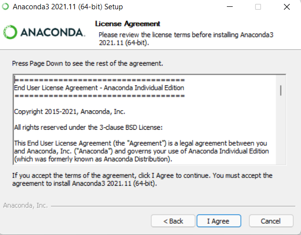
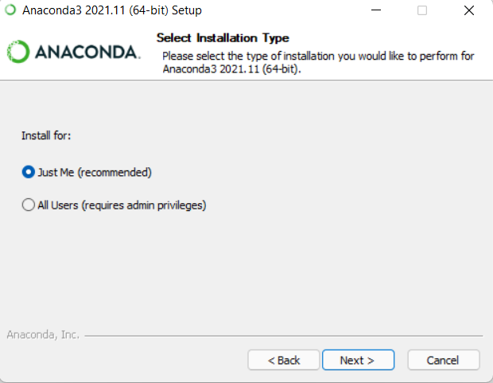
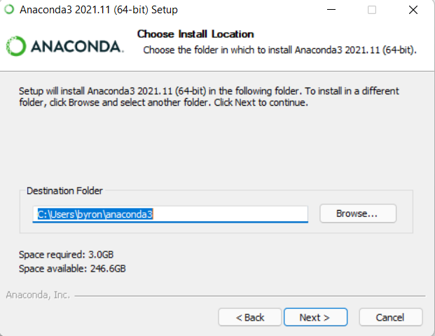
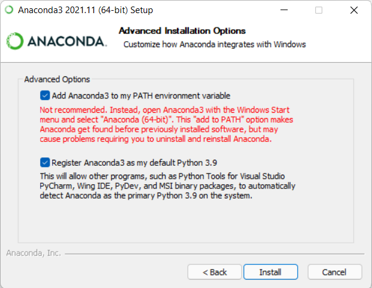
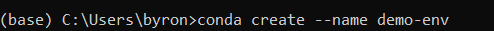
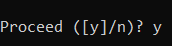
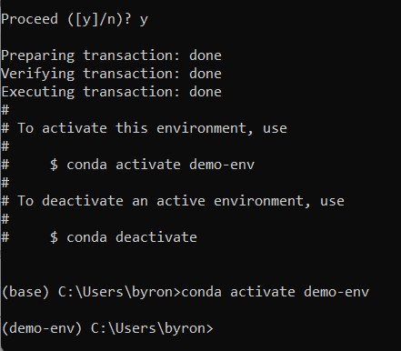

How to Install Anaconda 3 on Windows 11
=========================================

1. Go to this `link <https://www.anaconda.com/products/individual>`_.
2. Click the green “Download” button.
3. Once download is complete, click the file. The set-up window will appear.
4. Click “Next”.
5. Read the License Agreement and click “I agree”.

    
6. Select Install for “Just Me (recommended)”.

    
7. Choose the folder that you want the Anaconda installation to be located in. Once done, click “Next”.

8. Choose whether to add Anaconda to your PATH environment variable. I checked the box so I would be able to run Anaonda in Command Prompt.
9. Choose whether to register Anaconda as your default Python. It is recommended to leave this box checked.

10. Click “Install”.
11. Once installation is complete, click “Next”.
12. Click “Next”, again.
13. Click "Finish".
14. To confirm Anaconda was installed, you can search “Anaconda Prompt” and click to open. Type “Python” and it should include Anaconda with the version information.
15. To confirm installation, you can also search “Anaconda Navigator” on your computer and open it. If the application opens, Anaconda was successfully installed.

Creating a Conda Environment
---------------------------------

1. Open Anaconda Prompt
2. Type “conda create –name demo-env”. As a note, “demo-env” is the name I chose for my environment name. You have the option to name it anything of your choice.

    
3. You will be asked if you want to proceed (y/n). Type “y”.

    
4. Next, it will give you a line to copy that will activate the environment. Type it out and press enter. Your conda environment is now activated.

|
| Developed by: Byron Pritchett, Jr.
| Documented by: Byron Pritchett, Jr.
| Tested by: -
