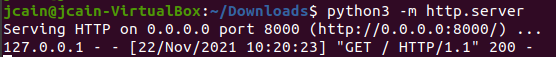
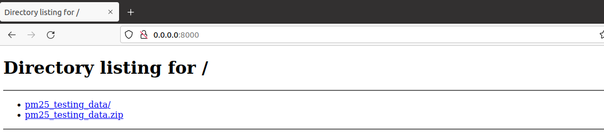

Data Acquisition Using Simple HTTP Server
======================================

| With python installed, the terminal can be used to start a simple HTTP server.
|
| This server can be used to remotely transfer files between two devices on the same network.
|
| Before starting the server, change directories in the terminal to whichever directory you would like to upload to the server.
|
| When using Python3, use the following command to start the server
.. code-block::

        python3 -m http.server
  
 
 

 
 
| It will then show a URL for the server where the files can be accessed.
|
| The files can be viewed by inputing the url into your web browser.

| This server can be stopped at anypoint by pressing Ctrl + C.
|
| In the terminal you can then type commands to retrieve files from the server.
|
| To download a single file using wget use the following command.

.. code-block::

        wget http://link.edu/filename
        
 

        
 
