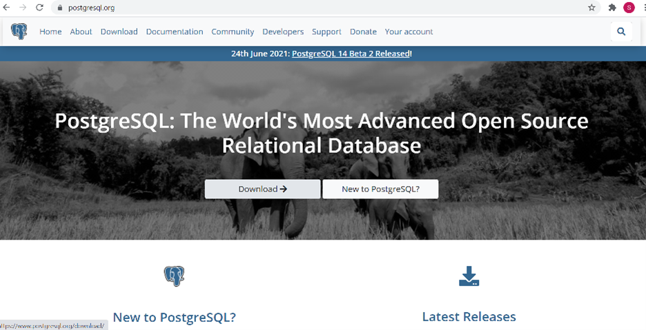
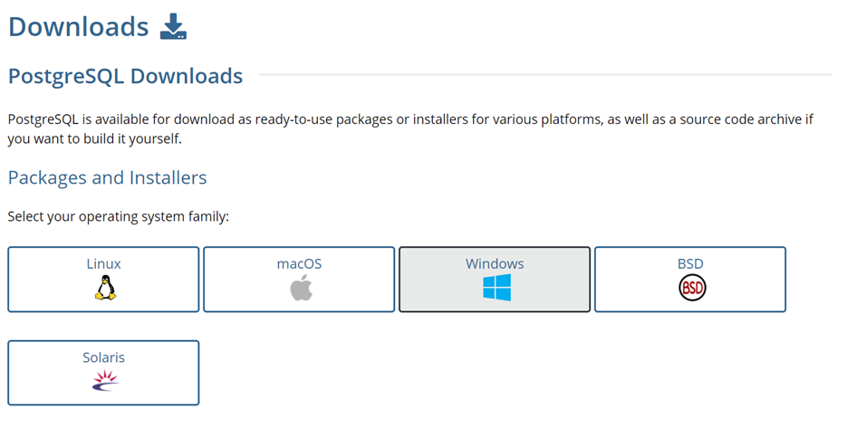
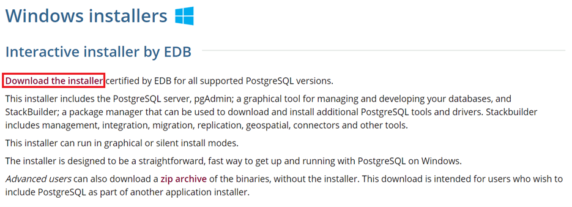
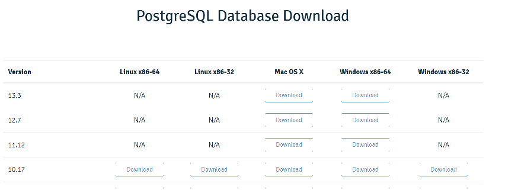
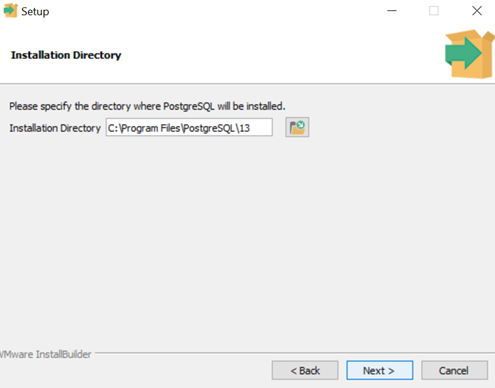
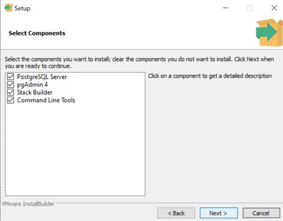
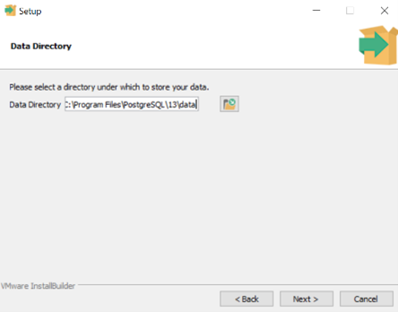
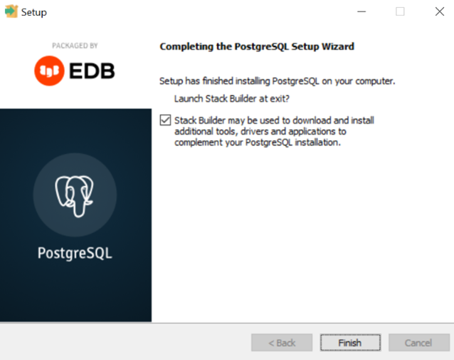

Installing PostgreSQL
=======================

1.	Navigate to postgressql.org and select the “Download” option.

2.	Select the download suitable for your operating system. In this example, Windows is selected.

3.	Click on the link (“Download the installer”) and you will be directed to the downloads page.

4.	Select the download link that fits your desired version and your system. In this case, the Windows x86-64, Version 13.3 is selected.

5.	Select the directory where you would like PostgreSQL installed.

6.	Make sure all boxes are selected, then select “next”.

7.	Select your chosen data directory.

8.	Proceed with your installation.
9.	Congratulations! PostgresSQL is now installed on your machine successfully.

Installing Slack Builder
--------------------------
1.	Select PostgreSQL from the drop-down menu on the Slack Builder.
2.	Under “Spatial Extensions”, install “PostGIS 3.0 Bundle for PostgreSQL 13 (64 bit) v3.0.3.
3.	Select your chosen directory and proceed.
4.	After an installation process, you should reach this window. Leave the checkbox unmarked and click “Next”.
5.	Agree to the terms and services.
6.	Make sure PostGIS is selected. Proceed.
7.	Select your destination folder. Proceed.
8.	Answer “Yes” to all pop-up questions.
9.	Congratulations! You’ve installed PostGIS and Stack Builder.
