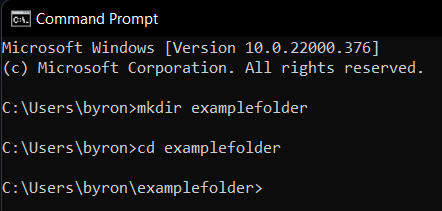

Setting up WAMP Server
==================================

1. Download WAMP server from this link: `<https://sourceforge.net/projects/wampserver/>`_.
2. Open the downloaded file, follow the instructions on screen including license agreement, folder location, etc and continue to press “Next”.
3. Accept the default installation settings.

4. Click next and install the default settings.
5. After installation is complete, go to the start menu and press on Wampserver64.
6. If the installation is successful and all services are running, the server icon will show as a green color in the task bar.
7. Go to `<https://sourceforge.net/projects/wampserver/>'__ and verify the server index page.

Set up MySQL database
--------------------------
8. Click on phpMyAdmin to access phpMyAdmin.
9. Give the username as “root” (default username) and click “Go”.
10. Click “New” to create a new database.
11. Type a name for your database and collation “utf8_general_ci". As an example, I named the database “demo-db” in the image below.
12. Click "Create".
